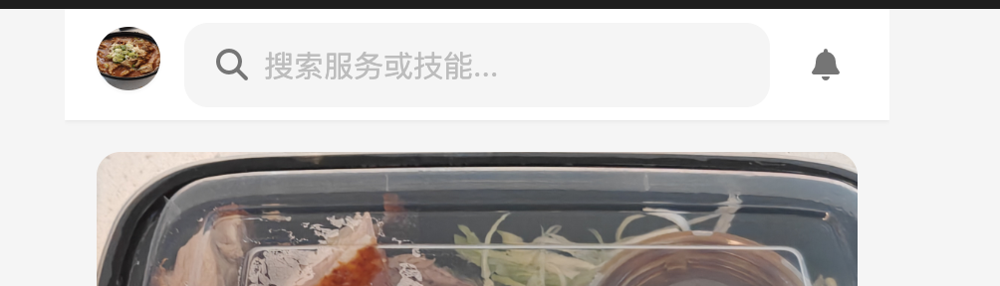
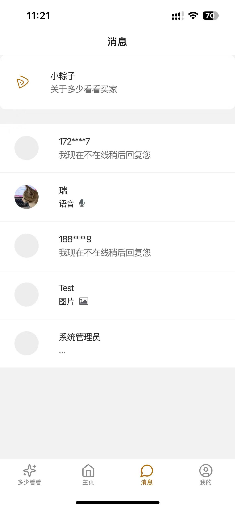
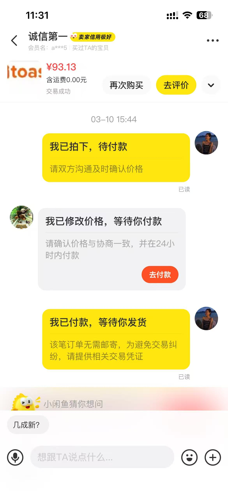

# 功能点问题

Assign: Dai Xiaoman
Status: Next Up
Date Created: 2025年3月26日 23:13

[http://127.0.0.1:3000/new-proto/HTML-new/index.html](http://127.0.0.1:3000/new-proto/HTML-new/index.html)

删掉首页的铃铛和热门故事板块

首页以下部分变成瀑布图，间隙变小

[http://127.0.0.1:3000/new-proto/HTML-new/chat.html](http://127.0.0.1:3000/new-proto/HTML-new/chat.html)

买卖家消息页面一样，系统通知在上面，用户消息在下面，中间隔开：

[http://127.0.0.1:3000/new-proto/HTML-new/profile.html](http://127.0.0.1:3000/new-proto/HTML-new/profile.html)

买家我的删掉成为卖家板块：

[http://127.0.0.1:3000/new-proto/HTML-new/seller_post.html](http://127.0.0.1:3000/new-proto/HTML-new/seller_post.html)

删掉卖家发布里抖音账号板块：

[http://127.0.0.1:3000/new-proto/HTML-new/chat_detail.html?id=ai](http://127.0.0.1:3000/new-proto/HTML-new/chat_detail.html?id=ai)

对话里面删掉右上角的两个图标

对话里面的上方加上类似下图中的订单流程显示，点击后跳转之前最右边图标的内容

[http://127.0.0.1:3000/new-proto/HTML-new/wallet_cards.html](http://127.0.0.1:3000/new-proto/HTML-new/wallet_cards.html)

删掉银行卡板块：

