# 买家端订单扭转(1)

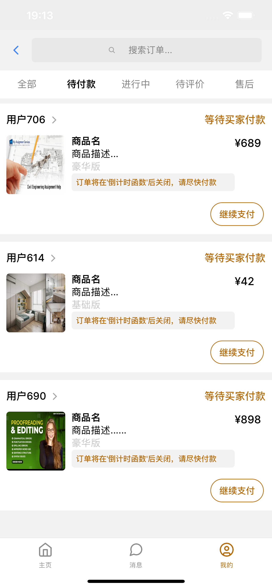

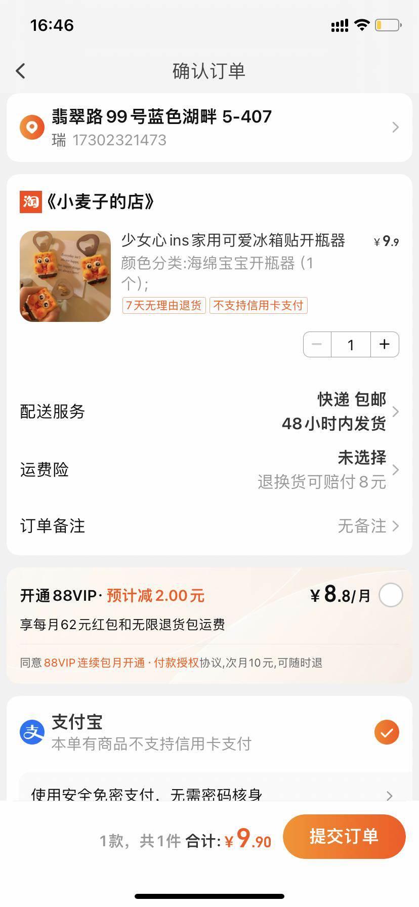

买家端

1. 待付款（awaitingPayment）

15分钟未付款自动关闭订单

点击跳转商品详情页（此处以淘宝

页面为例）

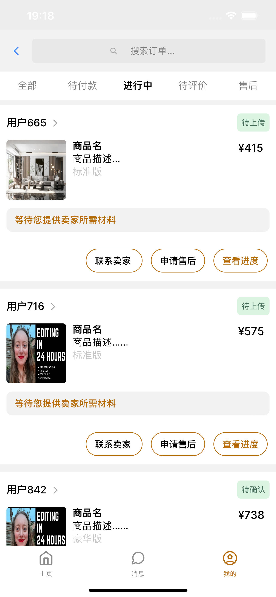

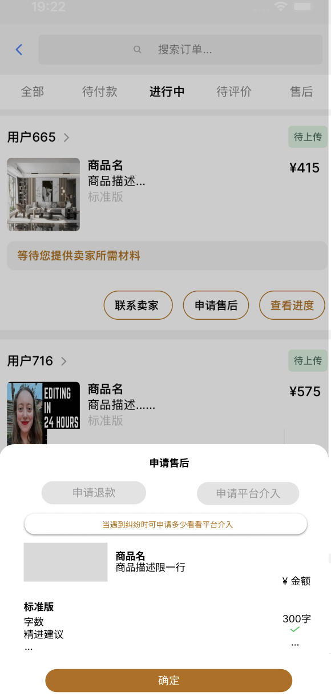

买家端（进行中）

2.包含

"awaitingSubmission", // 等待提交要求(2)

"awaitingStart", // 等待开始(卖家接单)(3)

"awaitingDelivery", // 等待卖家交付 (4)

"awaitingConfirmation", // 等待确认(5)

点击进入时间线页面

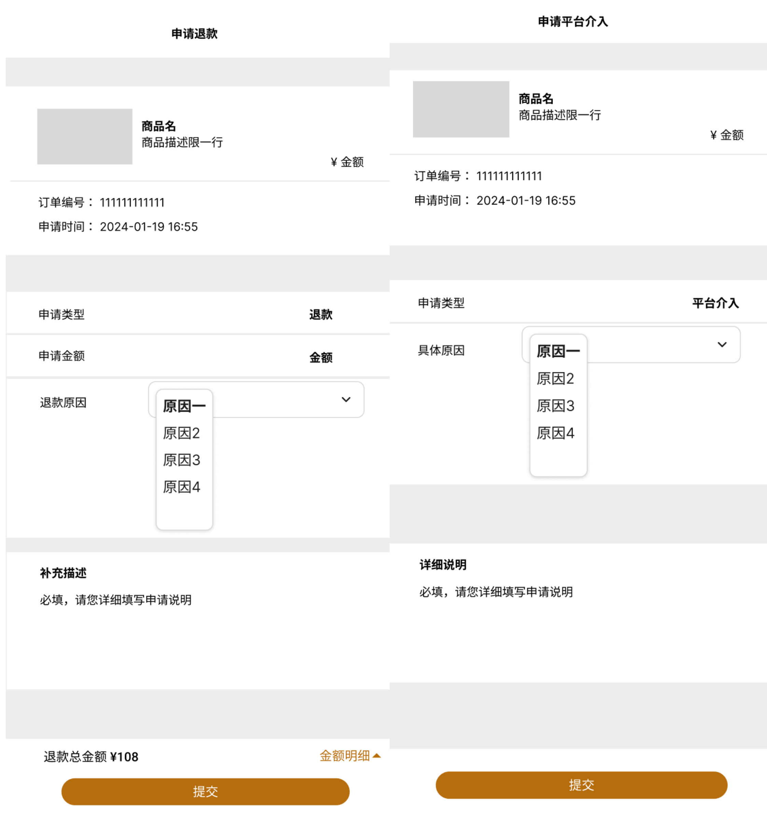

选择申请售后类型后跳转退款申请页，申请

类型固定不可修改。提交后跳转状态页

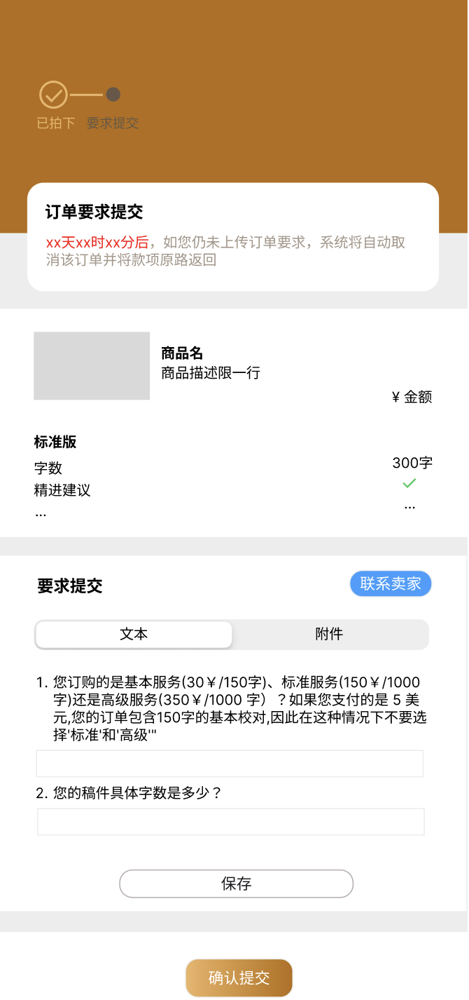

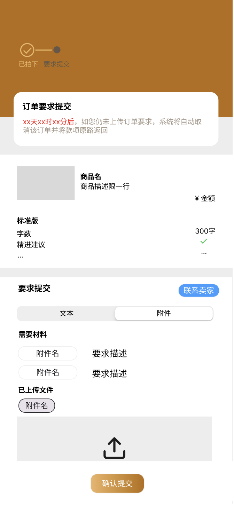

状态：”awaitingSubmission", // 等待提交要求(2)

时间线（上方时间节点设计不完善，仅表达

此刻进度，实际应该是完整的时间线）

状态： 等待提交要求(2)

要求提交分为文本类和附件类

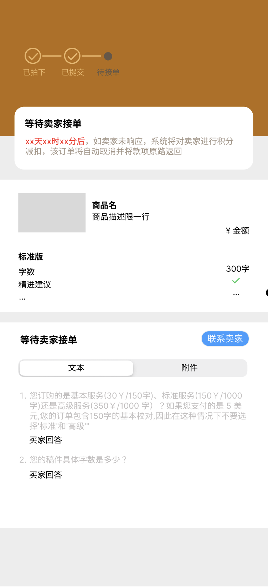

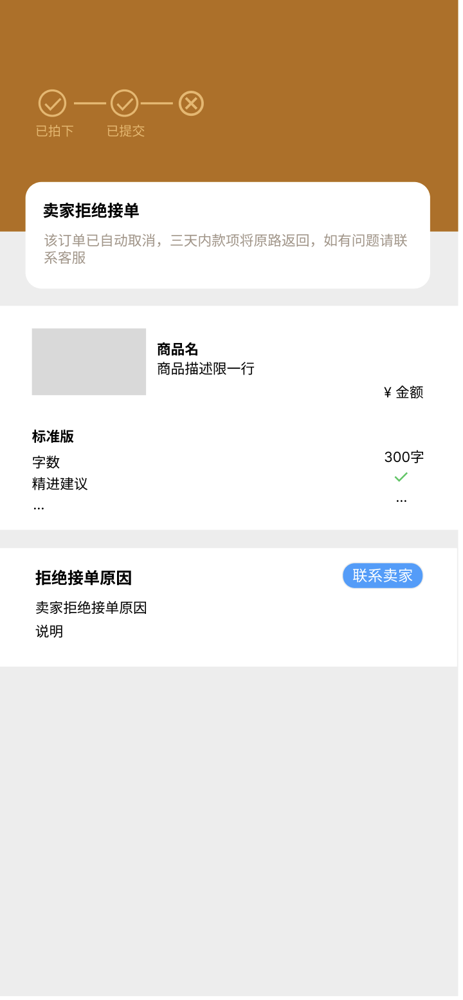

状态： "awaitingStart", // 等待开始(卖家接单)(3)

情况一：同意接单，进入下一个状态

情况二：拒绝接单

情况三：申请修改

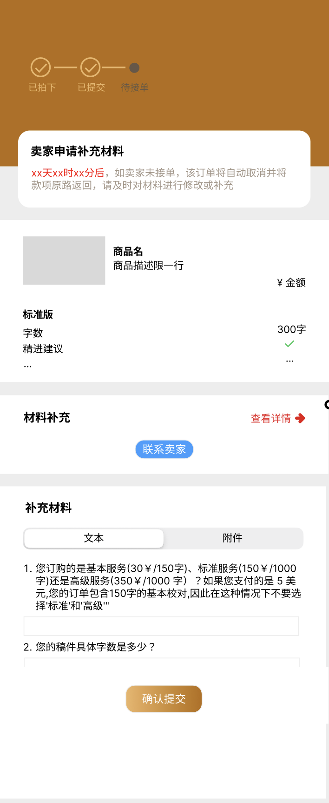

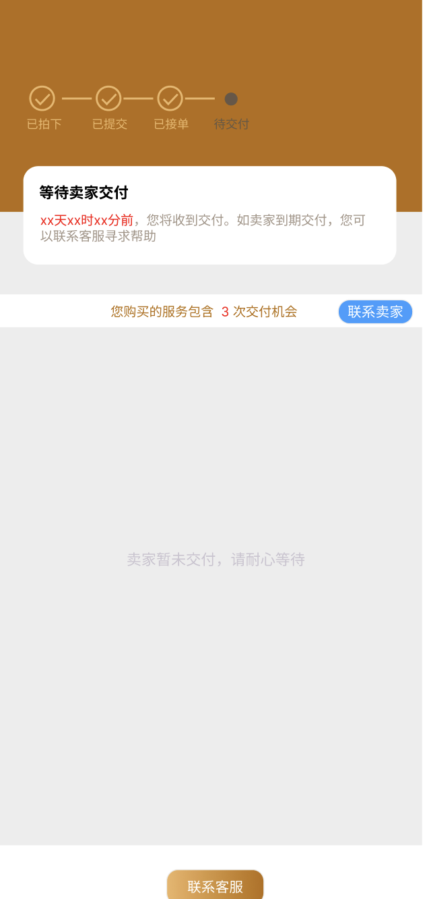

状态："awaitingDelivery", // 等待卖家交付 (4)

一经交付进入下一状态（待确认）

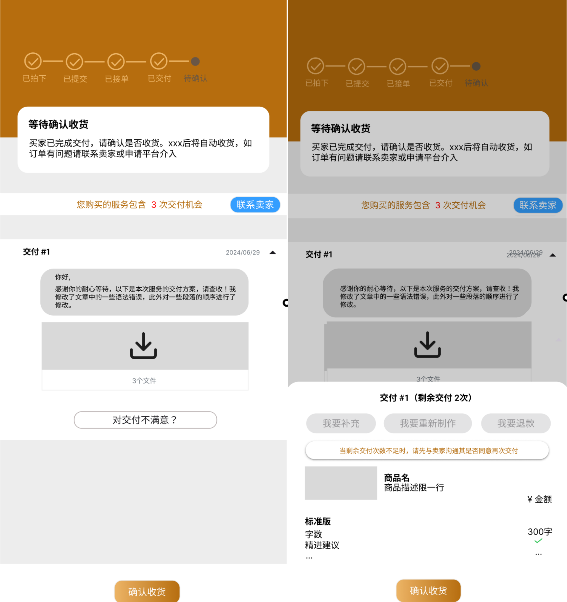

状态："awaitingConfirmation", // 等待确认(5)

情况一：对交付提出修改（修改/重做）

讨论交付次数的问题：修改申请会直接放发送卖家，

需要买家与卖家自行沟通，当卖家同意时自动进入交

付中，当卖家拒绝时有一个页面通知买家并引导至平

台介入

情况二：确认收货

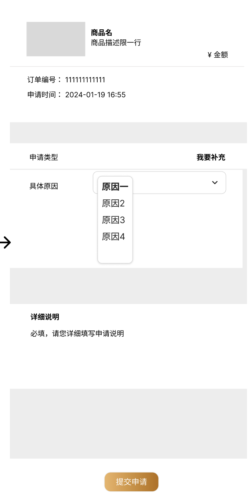

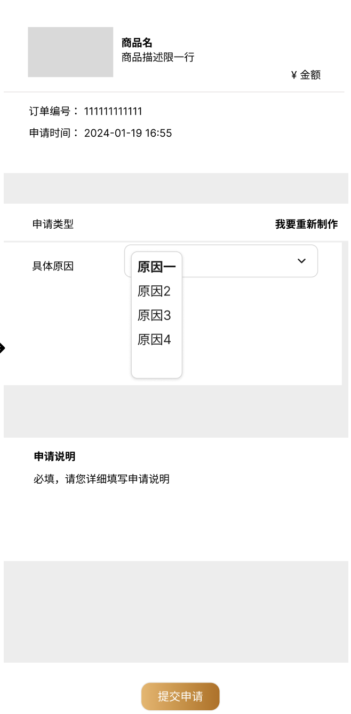

申请

仍然在待确认的时间点上

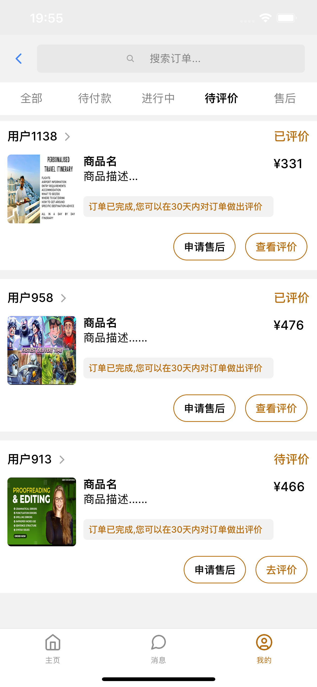

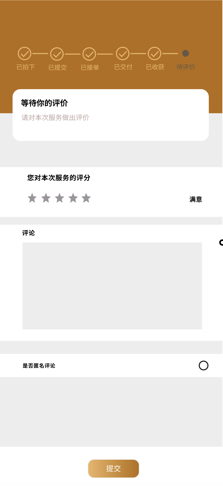

买家端（待评价）

包含：

"awatingEvaluation", // 等待评价(8)

"orderCompleted", // 订单成功结束(9)

依然跳转时间线界面

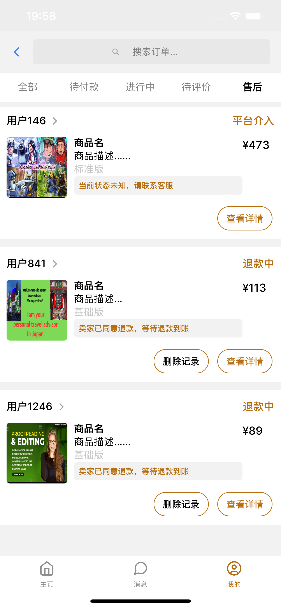

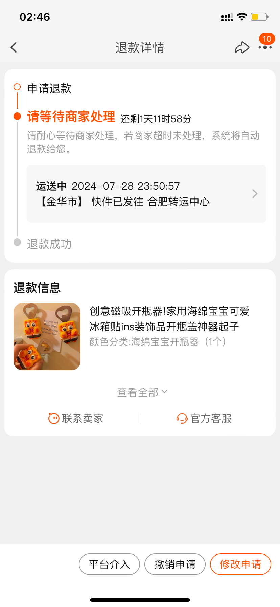

买家端（售后）

包含：

"applyingForRefund", // 买家提交退款/等待

卖家同意(10)

"awaitingRefund", // 等待款项(11)

"applyingForMediation", // 申请介入（12）

点击后跳转，此处以淘宝页面为例