# 卖家端订单扭转(1)

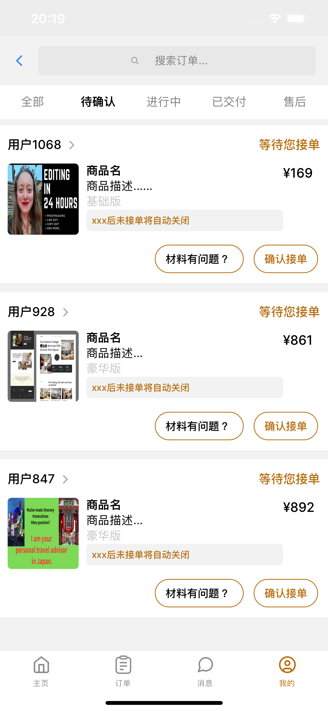

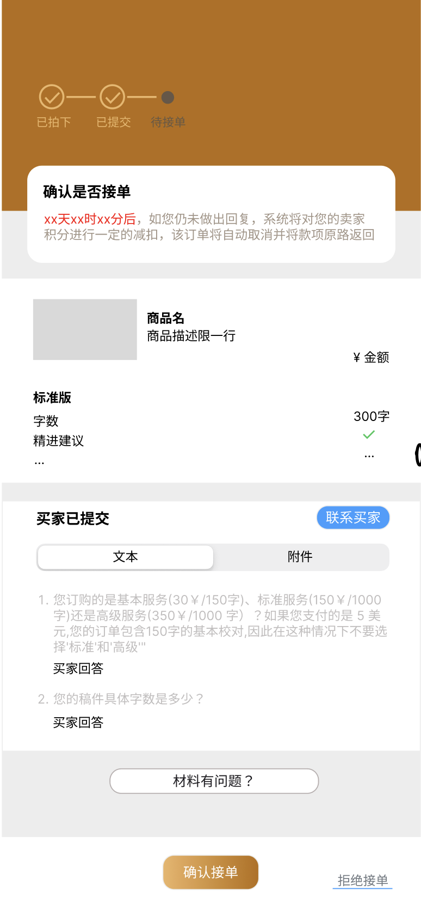

卖家待确认

点击进入时间线（直接到状态

待接单）

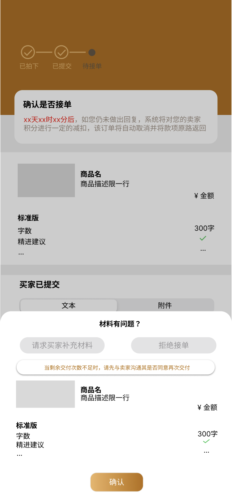

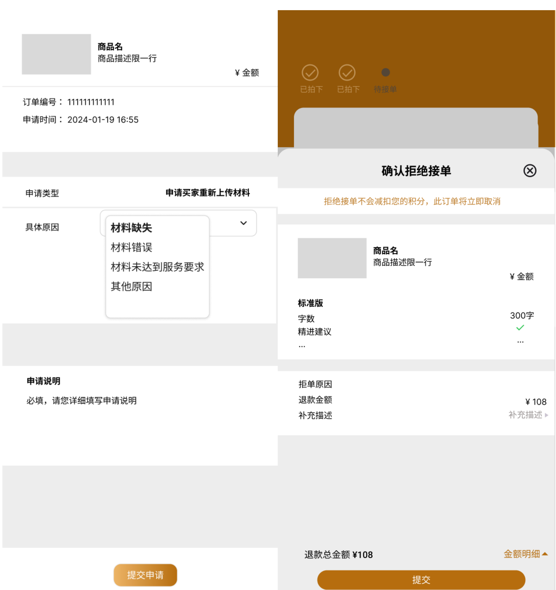

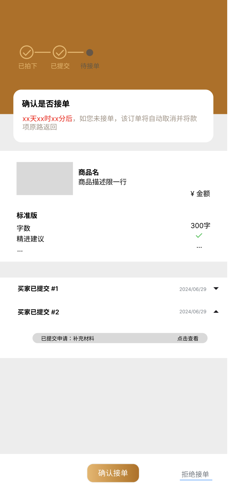

当买家有多次上传的材料时

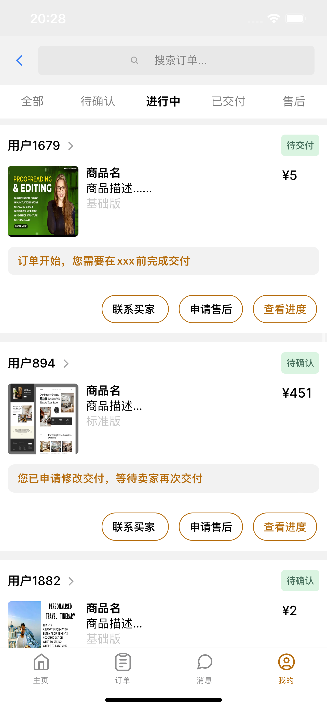

卖家进行中

包含

"awaitingDelivery", // 等待卖家交付 (4)

"awaitingComfirm", // 等待确认(5)

"awatingEvaluation", // 等待评价(8)

"orderCompleted", // 订单成功结束(9)

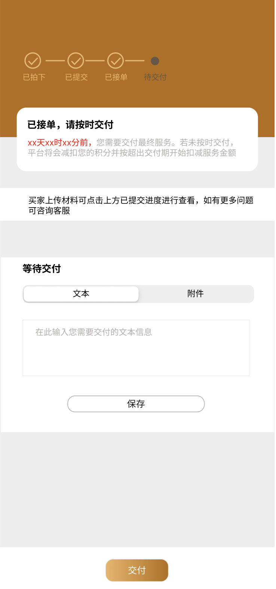

状态："awaitingDelivery", // 等待卖家交付 (4)

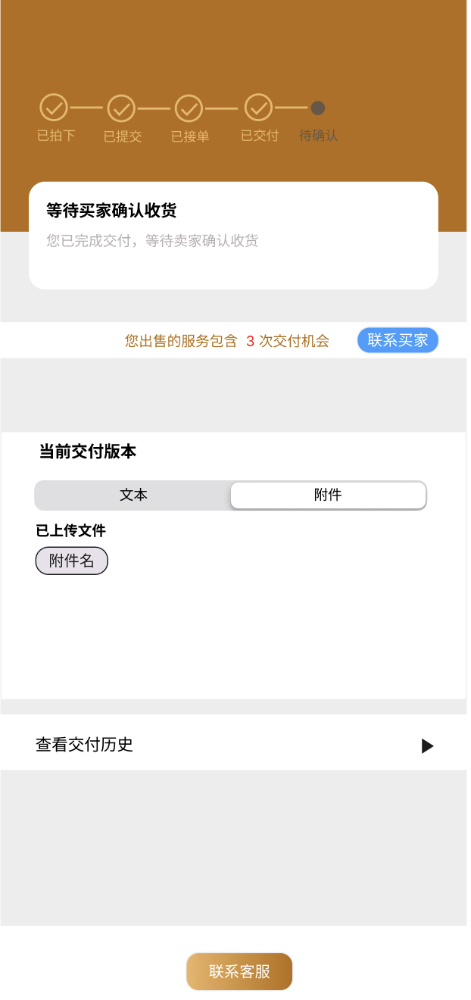

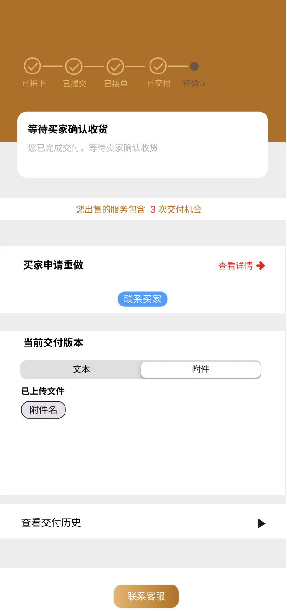

状态"awaitingComfirm", // 等待确认(5)

情况一：买家申请修改/重做

情况二：买家确认收货，进入下一个状态

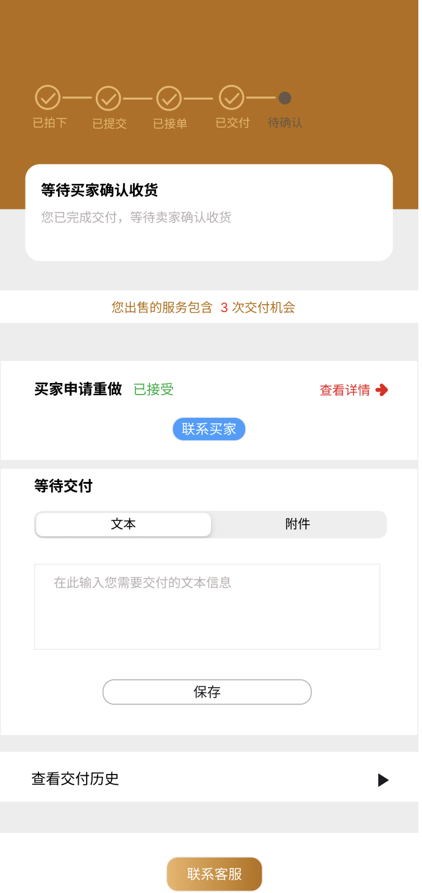

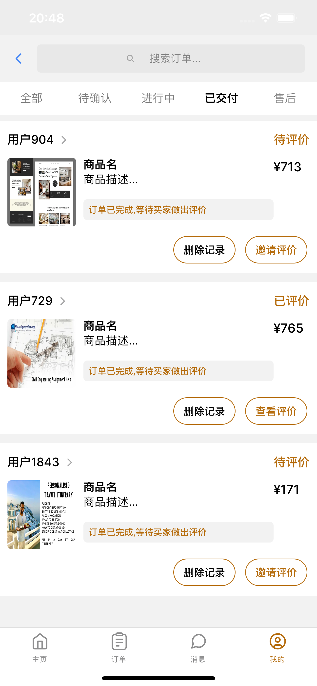

卖家端 （已交付）

点击跳转时间线

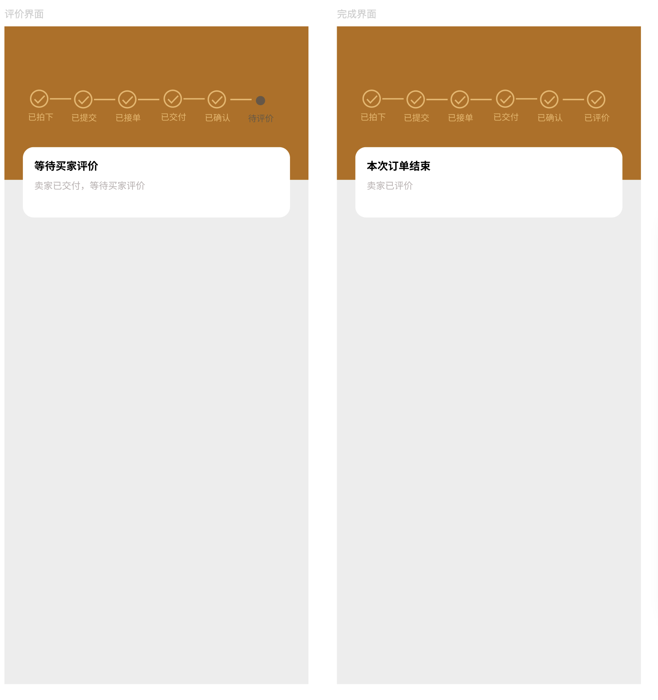

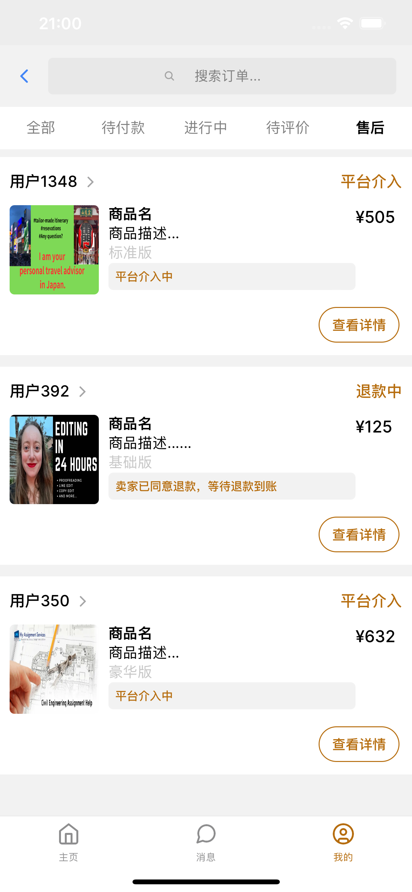

卖家端（售后）