# 截图与页面对应关系

本文档记录了原型截图与HTML页面之间的对应关系，便于对比和测试。

## 订单列表页面

| 截图 | 对应HTML页面 | 状态/标签 |
|------|-------------|----------|
| 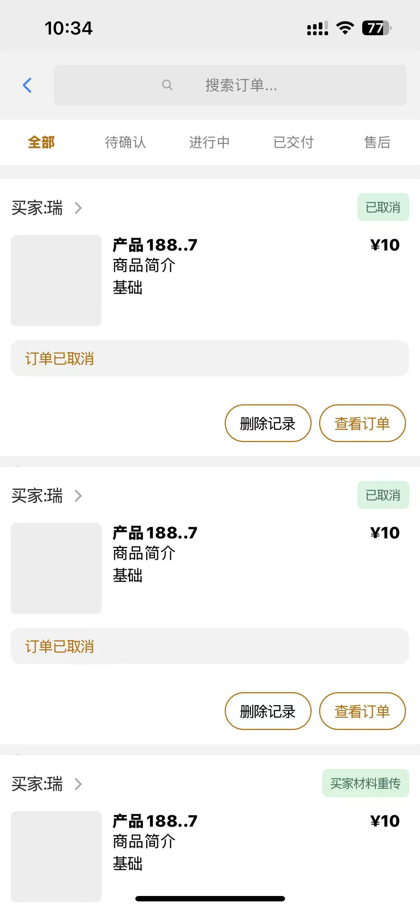 | [订单列表页面](file:///c:/Code/Indie/DSKKfrontrenew/DSKK-renew/new-proto/HTML-new/tabs/profile/orders/orders.html) | 全部 |
| 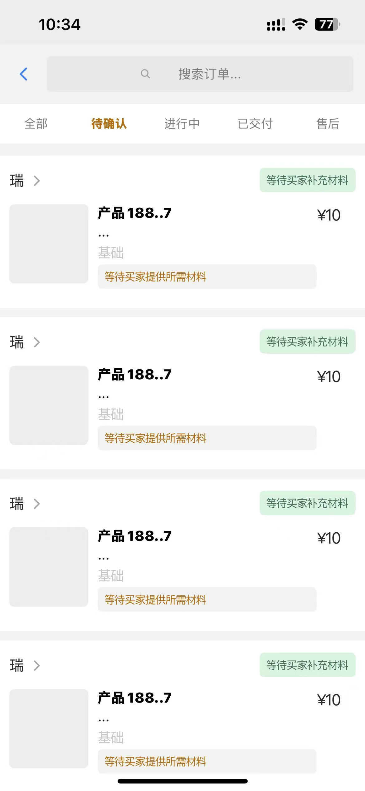 | [订单列表页面](file:///c:/Code/Indie/DSKKfrontrenew/DSKK-renew/new-proto/HTML-new/tabs/profile/orders/orders.html) | 待确认 |
| 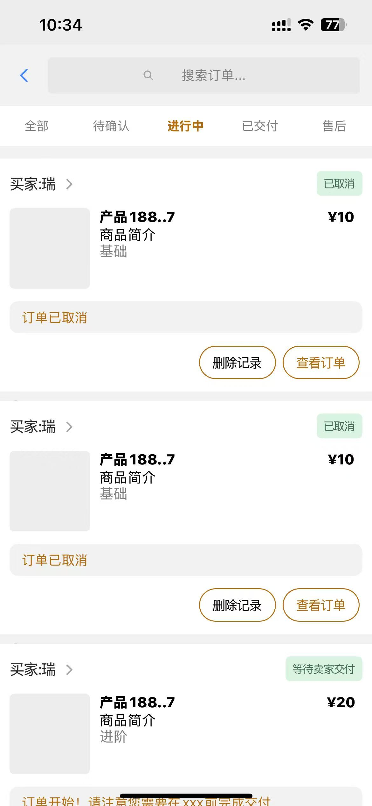 | [订单列表页面](file:///c:/Code/Indie/DSKKfrontrenew/DSKK-renew/new-proto/HTML-new/tabs/profile/orders/orders.html) | 进行中 |
| 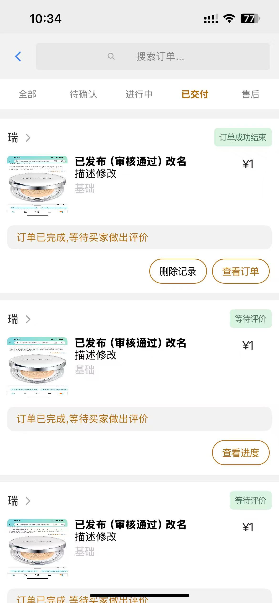 | [订单列表页面](file:///c:/Code/Indie/DSKKfrontrenew/DSKK-renew/new-proto/HTML-new/tabs/profile/orders/orders.html) | 已支付 |
| 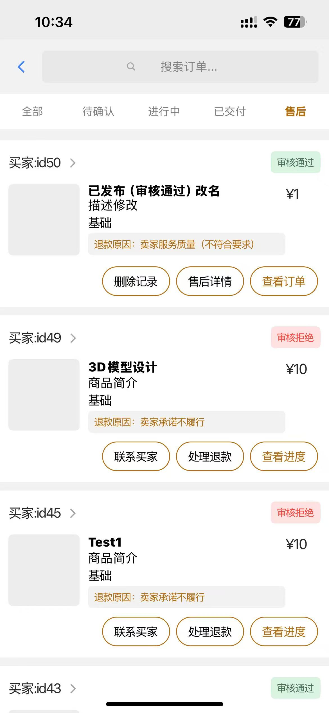 | [订单列表页面](file:///c:/Code/Indie/DSKKfrontrenew/DSKK-renew/new-proto/HTML-new/tabs/profile/orders/orders.html) | 售后 |

## 订单详情页面

### 已取消订单详情
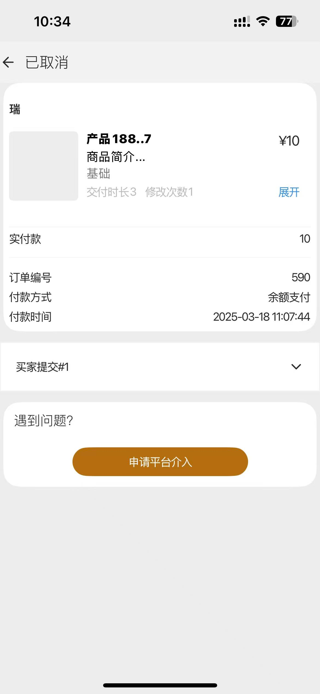
- 买家页面: [已取消订单详情页面](file:///c:/Code/Indie/DSKKfrontrenew/DSKK-renew/new-proto/HTML-new/tabs/profile/orders/order_cancelled.html)
- 卖家页面: [卖家已取消订单详情页面](file:///c:/Code/Indie/DSKKfrontrenew/DSKK-renew/new-proto/HTML-new/sellerscreens/profile/orders/seller_order_cancelled.html)

### 材料重传订单详情
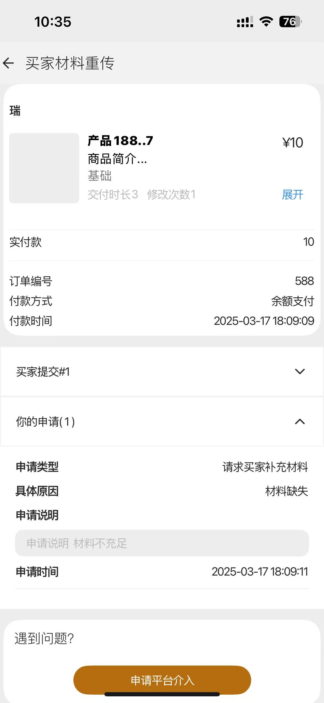
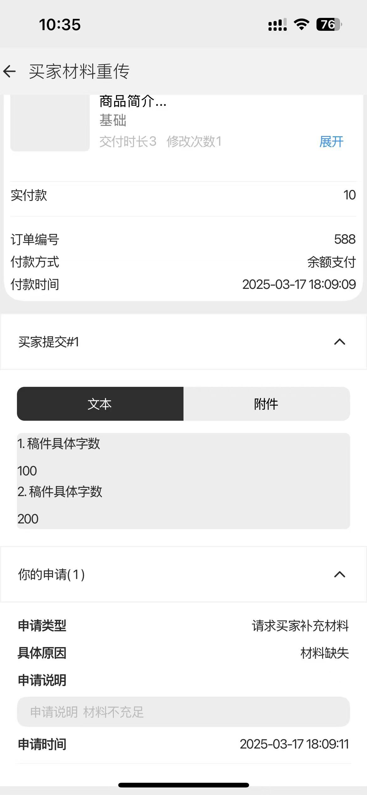
- 买家页面: [材料重传订单详情页面](file:///c:/Code/Indie/DSKKfrontrenew/DSKK-renew/new-proto/HTML-new/tabs/profile/orders/order_repost_materials.html)
- 卖家页面: [卖家重新交付订单详情页面](file:///c:/Code/Indie/DSKKfrontrenew/DSKK-renew/new-proto/HTML-new/sellerscreens/profile/orders/seller_order_redelivery.html)

### 订单流程显示（已交付）
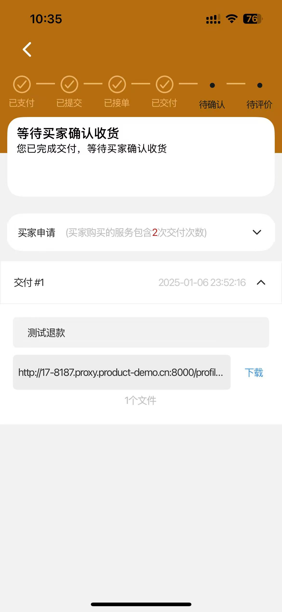
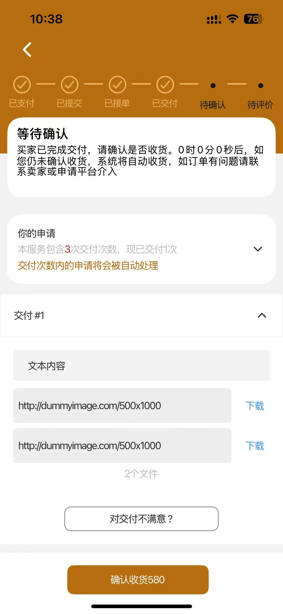
- 买家页面: [买家已交付订单页面](file:///c:/Code/Indie/DSKKfrontrenew/DSKK-renew/new-proto/HTML-new/tabs/profile/orders/order_delivered.html)
- 卖家页面: [卖家已交付订单页面](file:///c:/Code/Indie/DSKKfrontrenew/DSKK-renew/new-proto/HTML-new/sellerscreens/profile/orders/seller_order_delivered.html)

### 订单流程显示（已接单）
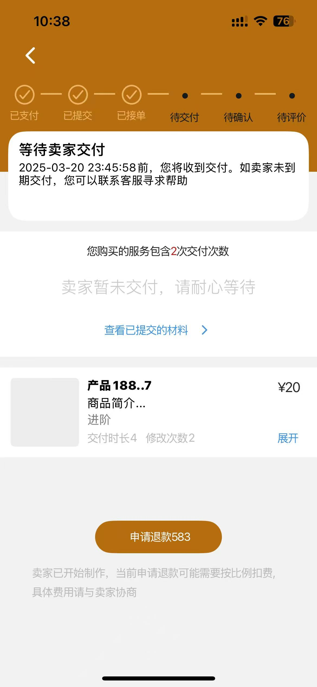
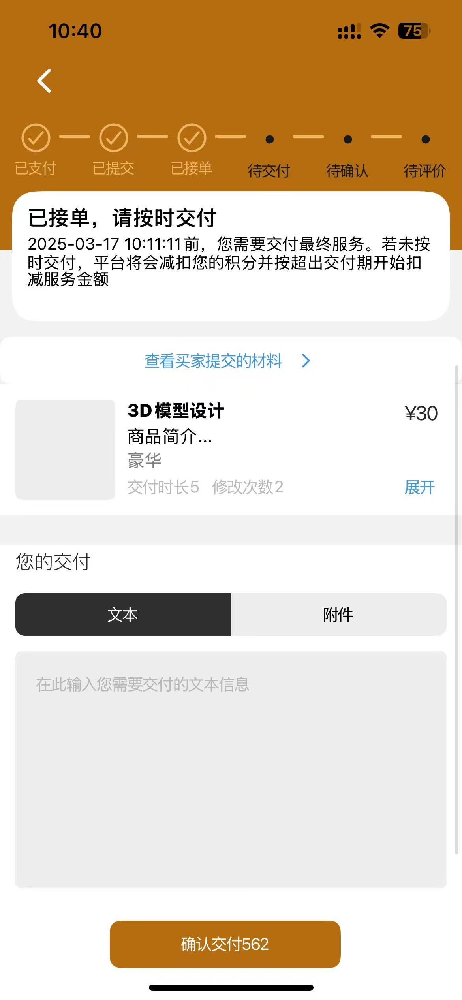
- 买家页面: [进行中订单详情页面](file:///c:/Code/Indie/DSKKfrontrenew/DSKK-renew/new-proto/HTML-new/tabs/profile/orders/order_in_progress.html)
- 卖家页面: [卖家进行中订单详情页面](file:///c:/Code/Indie/DSKKfrontrenew/DSKK-renew/new-proto/HTML-new/sellerscreens/profile/orders/seller_order_in_progress.html)

### 订单流程显示（待评价）
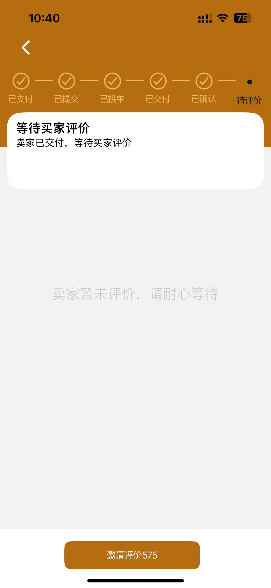
- 买家页面: [订单详情页面](file:///c:/Code/Indie/DSKKfrontrenew/DSKK-renew/new-proto/HTML-new/tabs/profile/orders/order_detail.html)
- 卖家页面: [卖家订单详情页面](file:///c:/Code/Indie/DSKKfrontrenew/DSKK-renew/new-proto/HTML-new/sellerscreens/profile/orders/seller_order_detail.html)

### 订单平台介入
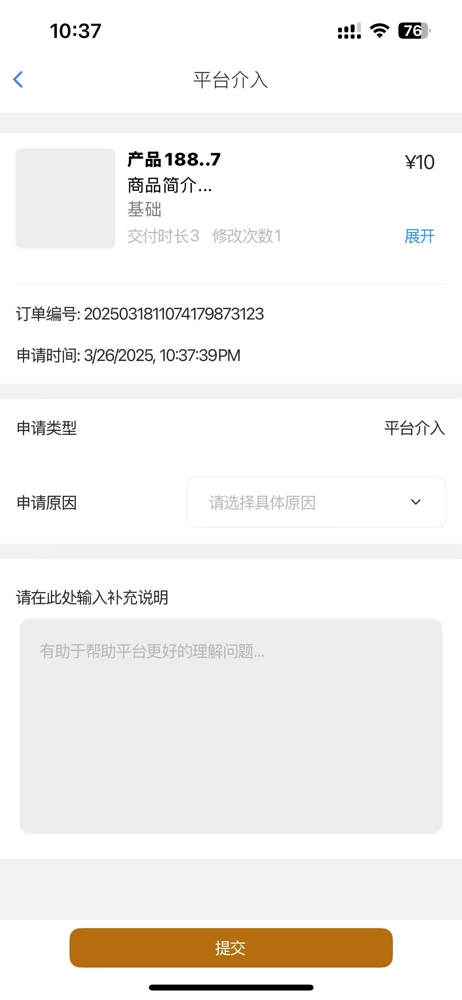
- 买家页面: [平台介入订单详情页面](file:///c:/Code/Indie/DSKKfrontrenew/DSKK-renew/new-proto/HTML-new/tabs/profile/orders/order_platform_intervention.html)
- 卖家页面: [卖家平台介入订单详情页面](file:///c:/Code/Indie/DSKKfrontrenew/DSKK-renew/new-proto/HTML-new/sellerscreens/profile/orders/seller_order_platform_intervention.html)

### 订单申请退款
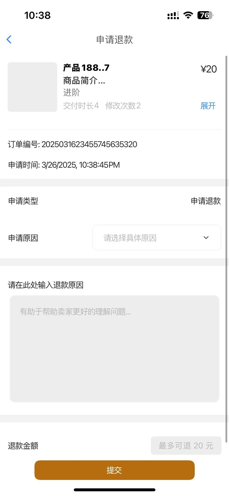
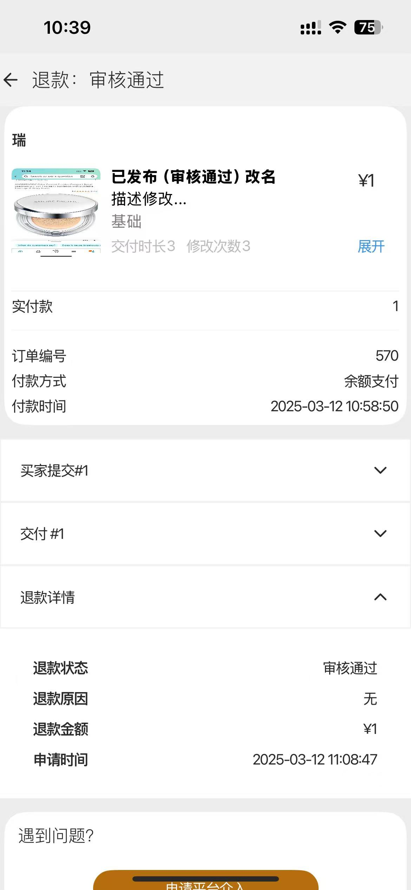
- 买家页面: [退款订单详情页面](file:///c:/Code/Indie/DSKKfrontrenew/DSKK-renew/new-proto/HTML-new/tabs/profile/orders/order_refund.html)
- 卖家页面: [卖家退款订单详情页面](file:///c:/Code/Indie/DSKKfrontrenew/DSKK-renew/new-proto/HTML-new/sellerscreens/profile/orders/seller_order_refund.html)

### 退款审核通过

- 买家页面: [退款审核通过页面](file:///c:/Code/Indie/DSKKfrontrenew/DSKK-renew/new-proto/HTML-new/tabs/profile/orders/order_refund_approved.html)
- 卖家页面: [卖家退款审核通过页面](file:///c:/Code/Indie/DSKKfrontrenew/DSKK-renew/new-proto/HTML-new/sellerscreens/profile/orders/seller_order_refund_approved.html)

## 卖家端页面

卖家端页面与买家端页面结构类似，但路径不同：

| 买家端页面 | 卖家端对应页面 |
|-----------|--------------|
| [订单列表页面](file:///c:/Code/Indie/DSKKfrontrenew/DSKK-renew/new-proto/HTML-new/tabs/profile/orders/orders.html) | [卖家订单列表页面](file:///c:/Code/Indie/DSKKfrontrenew/DSKK-renew/new-proto/HTML-new/sellerscreens/profile/orders/seller_orders.html) |
| [订单详情页面](file:///c:/Code/Indie/DSKKfrontrenew/DSKK-renew/new-proto/HTML-new/tabs/profile/orders/order_detail.html) | [卖家订单详情页面](file:///c:/Code/Indie/DSKKfrontrenew/DSKK-renew/new-proto/HTML-new/sellerscreens/profile/orders/seller_order_detail.html) |
| [待确认订单详情页面](file:///c:/Code/Indie/DSKKfrontrenew/DSKK-renew/new-proto/HTML-new/tabs/profile/orders/order_awaiting_confirmation.html) | [卖家待确认订单详情页面](file:///c:/Code/Indie/DSKKfrontrenew/DSKK-renew/new-proto/HTML-new/sellerscreens/profile/orders/seller_order_awaiting_confirmation.html) |
| [进行中订单详情页面](file:///c:/Code/Indie/DSKKfrontrenew/DSKK-renew/new-proto/HTML-new/tabs/profile/orders/order_in_progress.html) | [卖家进行中订单详情页面](file:///c:/Code/Indie/DSKKfrontrenew/DSKK-renew/new-proto/HTML-new/sellerscreens/profile/orders/seller_order_in_progress.html) |
| [已支付订单详情页面](file:///c:/Code/Indie/DSKKfrontrenew/DSKK-renew/new-proto/HTML-new/tabs/profile/orders/order_paid.html) | [卖家已支付订单详情页面](file:///c:/Code/Indie/DSKKfrontrenew/DSKK-renew/new-proto/HTML-new/sellerscreens/profile/orders/seller_order_paid.html) |
| [已取消订单详情页面](file:///c:/Code/Indie/DSKKfrontrenew/DSKK-renew/new-proto/HTML-new/tabs/profile/orders/order_cancelled.html) | [卖家已取消订单详情页面](file:///c:/Code/Indie/DSKKfrontrenew/DSKK-renew/new-proto/HTML-new/sellerscreens/profile/orders/seller_order_cancelled.html) |
| [材料重传订单详情页面](file:///c:/Code/Indie/DSKKfrontrenew/DSKK-renew/new-proto/HTML-new/tabs/profile/orders/order_repost_materials.html) | [卖家重新交付订单详情页面](file:///c:/Code/Indie/DSKKfrontrenew/DSKK-renew/new-proto/HTML-new/sellerscreens/profile/orders/seller_order_redelivery.html) |
| [平台介入订单详情页面](file:///c:/Code/Indie/DSKKfrontrenew/DSKK-renew/new-proto/HTML-new/tabs/profile/orders/order_platform_intervention.html) | [卖家平台介入订单详情页面](file:///c:/Code/Indie/DSKKfrontrenew/DSKK-renew/new-proto/HTML-new/sellerscreens/profile/orders/seller_order_platform_intervention.html) |
| [退款订单详情页面](file:///c:/Code/Indie/DSKKfrontrenew/DSKK-renew/new-proto/HTML-new/tabs/profile/orders/order_refund.html) | [卖家退款订单详情页面](file:///c:/Code/Indie/DSKKfrontrenew/DSKK-renew/new-proto/HTML-new/sellerscreens/profile/orders/seller_order_refund.html) |
| [退款审核通过页面](file:///c:/Code/Indie/DSKKfrontrenew/DSKK-renew/new-proto/HTML-new/tabs/profile/orders/order_refund_approved.html) | [卖家退款审核通过页面](file:///c:/Code/Indie/DSKKfrontrenew/DSKK-renew/new-proto/HTML-new/sellerscreens/profile/orders/seller_order_refund_approved.html) |
| [买家已交付订单页面](file:///c:/Code/Indie/DSKKfrontrenew/DSKK-renew/new-proto/HTML-new/tabs/profile/orders/order_delivered.html) | [卖家已交付订单页面](file:///c:/Code/Indie/DSKKfrontrenew/DSKK-renew/new-proto/HTML-new/sellerscreens/profile/orders/seller_order_delivered.html) |

## 测试方法

1. 打开对应的HTML页面
2. 与截图进行对比，检查页面布局、内容和样式是否一致
3. 测试页面交互功能，如标签切换、按钮点击等
4. 记录不一致的地方，进行修改

## 最近修复的问题

1. 修复了订单列表页面不显示订单项的问题：
   - 修改了 `createOrderItem` 函数，使其直接返回 `container`，而不是 `container.firstChild`
   - 在 `DOMContentLoaded` 事件处理程序中添加了 `initOrderList('all')` 调用
   - 移除了 `handleAction` 函数中的 `addTestOrderItem` 函数重复定义

2. 验证了标签页切换功能正常工作：
   - 全部标签显示所有订单
   - 待确认标签显示待确认状态的订单
   - 进行中标签显示进行中状态的订单
   - 已支付标签显示已支付状态的订单
   - 已完成标签显示已完成状态的订单
   - 售后标签显示售后状态的订单