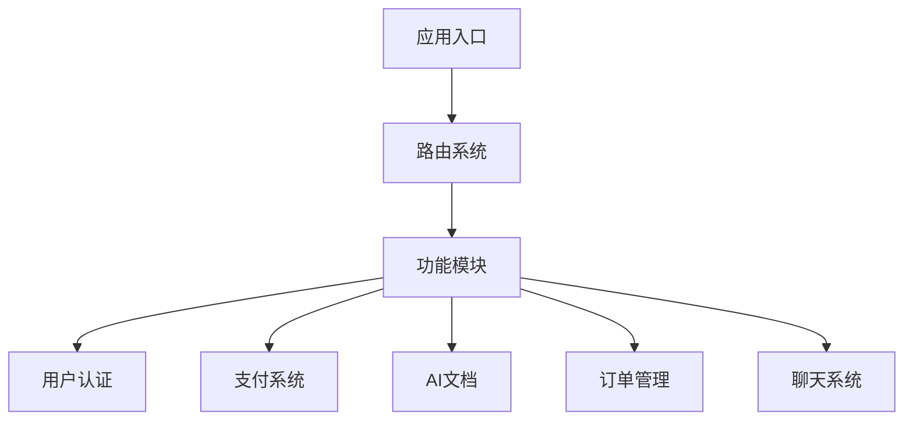
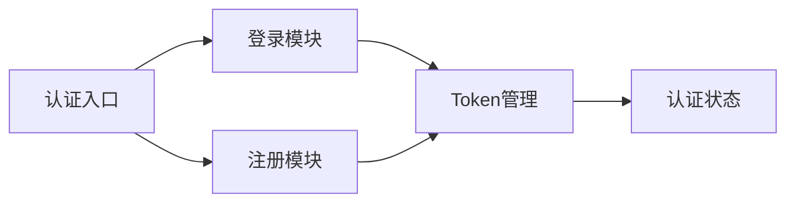
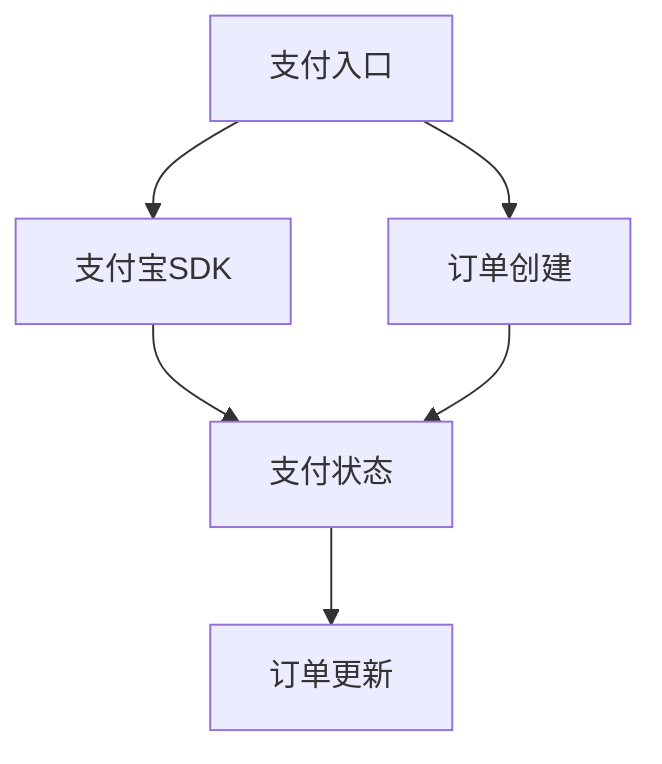
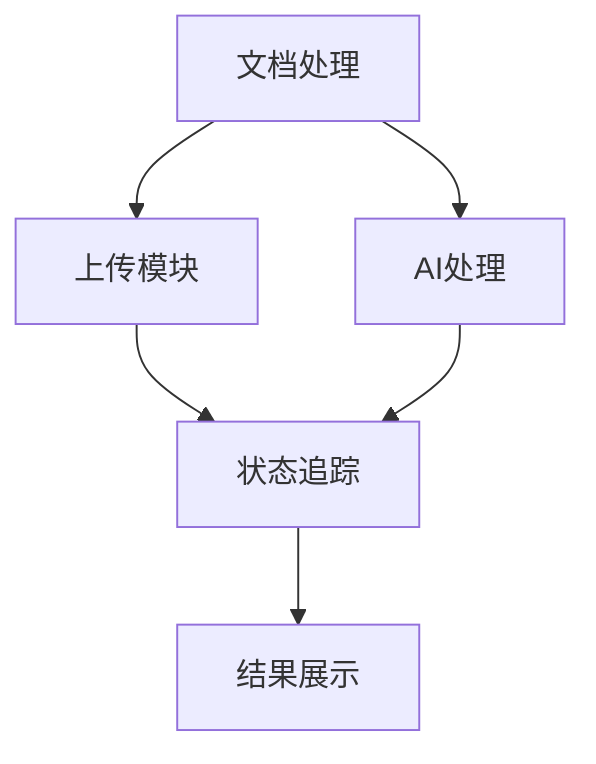

# 系统架构设计

## 整体架构


## 目录结构设计
1. 应用核心
   - `/app` - 应用路由和页面
   - `/components` - 可复用组件
   - `/constants` - 全局常量
   - `/sdk` - 核心功能封装
   - `/types` - 类型定义

2. 组件层次
   ```mermaid
   graph TD
       A[components] --> B1[基础组件]
       A --> B2[业务组件]
       A --> B3[页面组件]
       B1 --> C1[UI组件]
       B1 --> C2[工具组件]
       B2 --> D1[订单相关]
       B2 --> D2[支付相关]
       B2 --> D3[AI文档相关]
   ```

## 设计模式
1. 组件设计模式
   - 容器组件/展示组件分离
   - 高阶组件（HOC）封装
   - 自定义Hook抽象
   - Context全局状态管理

2. 状态管理
   - 全局状态：Context API
   - 本地状态：useState/useReducer
   - 缓存状态：cacheService

3. 通信模式
   - WebSocket实时通信
   - HTTP请求封装
   - 事件订阅/发布

## 核心模块设计

### 1. 认证系统


### 2. 支付系统


### 3. AI文档处理


## 安全设计
1. 数据安全
   - 敏感信息加密
   - Token认证
   - 数据校验

2. 支付安全
   - 支付流程加密
   - 订单状态验证
   - 交易信息保护

## 性能优化
1. 组件优化
   - 懒加载
   - 虚拟列表
   - 组件缓存

2. 资源优化
   - 图片懒加载
   - 资源预加载
   - 缓存策略

## 错误处理
1. 全局错误边界
2. 请求错误处理
3. 业务异常处理
4. 状态恢复机制

## 扩展性设计
1. 模块化架构
2. 插件化设计
3. 配置化开发
4. API版本控制
