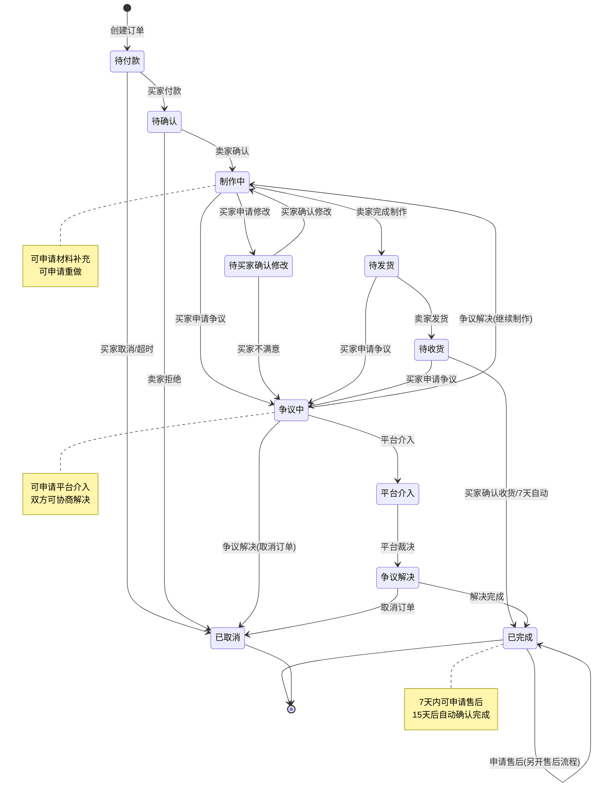

# 订单状态流转图与角色权限矩阵

**创建时间：** 2024-12-19  
**目的：** 可视化展示订单完整生命周期和各角色操作权限

---

## 📊 完整订单状态流转图

## 🎯 角色操作权限矩阵

### 买家操作权限

| 订单状态 | 可执行操作 | API端点 | 备注 |
|---------|-----------|---------|------|
| 待付款 | 取消订单、付款 | `/api/shop/order/cancel` | 30分钟内可取消 |
| 待确认 | 查看详情、等待确认 | - | 仅查看权限 |
| 制作中 | 申请修改、申请争议、补充材料 | `/api/project/orderDemand/add` | 核心交互阶段 |
| 待买家确认修改 | 确认修改、拒绝修改 | `/api/project/orderDemand/buyerReply` | 买家决策权 |
| 待发货 | 提醒发货、申请争议 | `/api/shop/order/remind` | 12小时间隔限制 |
| 待收货 | 确认收货、申请争议 | `/api/shop/order/complete` | 7天自动确认 |
| 争议中 | 申请平台介入、协商 | `/api/project/orderDemand/add` (type="platform") | 争议处理 |
| 已完成 | 评价、申请售后 | `/api/shop/evaluate/add`, 售后API | 评价和售后 |

### 卖家操作权限

| 订单状态 | 可执行操作 | API端点 | 备注 |
|---------|-----------|---------|------|
| 待付款 | 查看详情 | - | 仅查看权限 |
| 待确认 | 确认接单、拒绝订单 | `/api/shop/order/verify` | 24小时内确认 |
| 制作中 | 完成制作、回复需求 | `/api/project/orderDemand/sellerReview` | 核心制作阶段 |
| 待买家确认修改 | 等待买家确认 | - | 等待状态 |
| 待发货 | 发货、申请争议 | `/api/project/orderDelivery/add` | 发货操作 |
| 待收货 | 查看物流、申请争议 | - | 跟踪阶段 |
| 争议中 | 申请平台介入、协商 | `/api/project/orderDemand/add` (type="platform") | 争议处理 |
| 已完成 | 邀请评价、处理售后 | `/api/shop/order/invite` | 评价邀请 |

### 平台管理操作权限

| 场景 | 可执行操作 | 处理方式 | 备注 |
|------|-----------|----------|------|
| 平台介入申请 | 审核介入请求 | 后台管理系统 | 通过标记位识别 |
| 争议处理 | 裁决争议结果 | 后台系统处理 | 修改订单状态 |
| 售后处理 | 审核售后申请 | 售后管理系统 | 独立售后流程 |
| 订单监控 | 查看所有订单 | 管理后台 | 数据监控 |

## 🔄 状态分类说明

### 进行中状态 (蓝色)
- **待付款**: 订单创建，等待买家付款
- **待确认**: 买家已付款，等待卖家确认
- **制作中**: 卖家正在制作商品
- **待买家确认修改**: 买家申请修改，等待确认
- **待发货**: 制作完成，等待卖家发货
- **待收货**: 已发货，等待买家确认收货

### 争议状态 (黄色)
- **争议中**: 买卖双方产生争议
- **平台介入**: 平台参与争议处理
- **争议解决**: 争议处理完成

### 完成状态 (绿色)
- **已完成**: 订单正常完成

### 终止状态 (黑色)
- **已取消**: 订单被取消

## ⚙️ 自动化规则

### 超时自动触发
1. **付款超时**: 30分钟未付款自动取消
2. **确认超时**: 24小时未确认自动取消
3. **收货超时**: 7天未确认自动完成
4. **完成超时**: 15天后订单状态锁定

### 业务规则约束
1. **提醒发货**: 12小时内只能提醒一次
2. **评价邀请**: 每日只能邀请一次，最多邀请3次
3. **平台介入**: 同一订单最多申请2次
4. **售后申请**: 完成后7天内可申请

## 🚀 设计原则

### 状态安全性
- 确保状态流转的单向性和不可逆性
- 防止恶意操作和状态回滚
- 保障订单数据的完整性

### 用户体验
- 明确的状态提示和操作引导
- 合理的超时设置和自动化处理
- 充分的操作反馈和进度显示

### 公平保障
- 买卖双方权限平衡
- 争议处理的中立性
- 平台介入的及时性

---

**使用说明:**
1. 开发时请参考此图确保状态流转逻辑正确
2. UI设计应体现状态的视觉差异
3. 用户操作权限严格按照矩阵执行
4. 自动化规则需要后端定时任务支持 